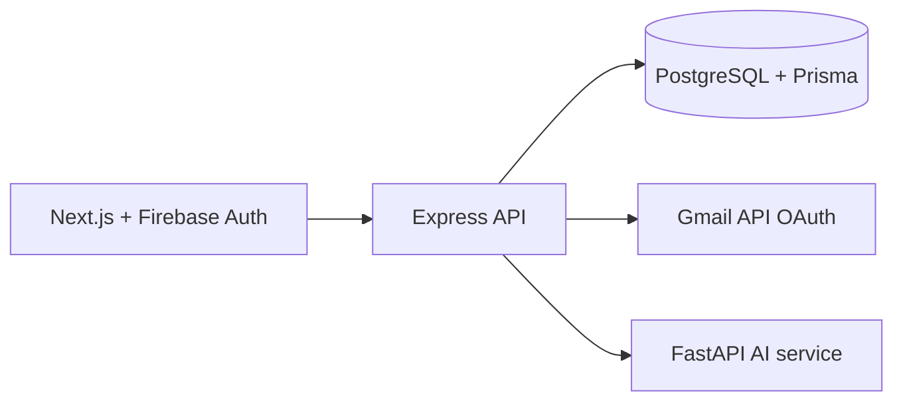

# MailGuard AI

MailGuard AI is a Gmail security workspace that uses the existing TF-IDF spam model and hybrid scam detector to classify permitted Gmail messages as `INBOX`, `SPAM`, or `SCAM`. Scam always wins when both detectors flag a message.

## Architecture



## Services

- `frontend`: Next.js App Router, Firebase Google sign-in, email dashboard.
- `backend`: Express, Firebase Admin verification, Gmail OAuth/sync, Prisma API.
- `ai-service`: FastAPI wrapper around `trained_models/` and the existing detectors.

## Setup

1. Create PostgreSQL database and copy `backend/.env.example` to `backend/.env`.
2. Enable Firebase Authentication with Google provider. Create a web app and copy its values into `frontend/.env.local`.
3. Create a Firebase Admin service account. Put its project ID, client email, and private key in `backend/.env`; preserve escaped newlines in the private key.
4. In Google Cloud, enable Gmail API, configure the OAuth consent screen, add `http://localhost:5000/api/gmail/callback` as an authorized redirect URI, and set the client credentials in `backend/.env`.
5. Copy `frontend/.env.local.example` to `frontend/.env.local` and `ai-service/.env.example` as `ai-service/.env`.
6. Install dependencies and create the Prisma client:

```powershell
cd backend
npm install
npx prisma generate
npx prisma migrate dev --name init
cd ..\frontend
npm install
cd ..\ai-service
python -m pip install -r requirements.txt
```

Train the AI models from the Kaggle spam/ham/phishing dataset:

```powershell
cd ai-service
.venv\Scripts\python.exe train.py
```

The training script downloads `akshatsharma2/the-biggest-spam-ham-phish-email-dataset-300000` through KaggleHub. Its labels are mapped as `0=ham`, `1=phishing`, and `2=spam`; the generated model files are saved in `ai-service/trained_models/` and are intentionally ignored by Git.

## Run

From the repository root, start all three development services with one command:

```powershell
npm install
npm run dev
```

This starts the AI service on `http://localhost:8000`, the backend on `http://localhost:5000`, and the frontend on `http://localhost:3000`. Keep this command running and do not launch another frontend `npm run dev` in a second terminal, or port 3000 will already be occupied.

You can also start them separately:

```powershell
# terminal 1
cd ai-service
uvicorn main:app --reload --port 8000

# terminal 2
cd backend
npm run dev

# terminal 3
cd frontend
npm run dev
```

Open `http://localhost:3000`. Sign in with Firebase first, then use **Connect Gmail**. Gmail refresh tokens remain server-side. Sync processes at most the latest 50 messages and skips stored Gmail message IDs.

The backend automatically checks all connected Gmail accounts when it starts and every five minutes. Set `GMAIL_SYNC_INTERVAL_MS` in `backend/.env` to customize the interval.

## API

- `POST /api/auth/sync-user`, `GET /api/auth/me`
- `GET /api/gmail/connect`, `/callback`, `/status`, `POST /sync`, `POST /disconnect`
- `GET /api/emails`, `/inbox`, `/spam`, `/scam`, `/:id`
- `GET /api/dashboard/stats`
- `POST http://localhost:8000/predict`, `GET http://localhost:8000/health`

Email list responses are paginated and omit full bodies. Detail responses include the stored AI analysis, matched keywords, and detected URLs.

## Security

Firebase ID tokens are verified by Firebase Admin on every protected API request. OAuth state is signed and short-lived. Helmet, CORS, rate limiting, Zod-ready typed boundaries, ownership filters, Prisma parameterization, and environment-only secrets are used. Never commit `.env` files, Firebase private keys, Gmail client secrets, or refresh tokens.

## Important configuration

Firebase and Google Cloud credentials cannot be generated automatically. The exact values must come from your Firebase project and Google Cloud OAuth client. PostgreSQL must be running before `prisma migrate dev` or the backend can start.